Below is an example of a `README.md` that you can customize and use for your project. You can copy the content into a new `README.md` file in your repository. Feel free to adjust the details as needed!

---

```markdown
# C# Mini Projects

This repository contains a collection of mini projects developed using **C#** and the **.NET Framework**. The application starts with a **Register** and **Login** screen, and upon successful authentication, displays a **Dashboard** (AIO.cs) that serves as a central hub to access various assignments. Each assignment demonstrates a specific functionality or UI feature in C#.

## Table of Contents

- [Features](#features)
- [Assignments Overview](#assignments-overview)
- [Directory Structure](#directory-structure)
- [Installation](#installation)
- [Usage](#usage)
- [Screenshots](#screenshots)
- [Technologies Used](#technologies-used)
- [License](#license)
- [Contributing](#contributing)

## Features

- **User Authentication**:  
  - **Sign Up / Register**: Allows new users to create an account.  
  - **Sign In / Login**: Enables registered users to log in.

- **Dashboard**:  
  - Displays a central hub (AIO.cs) with links to each mini project.

- **Mini Projects**:  
  Each assignment is designed to demonstrate a specific feature:
  - Splash Screen
  - Font Color Dialogue
  - Image Dialogue
  - Color Dialogue
  - Tool Tip
  - Context Menu Strip
  - ComboBox (and similar variations)
  - Suggestion functionality
  - SteamFile (basic file streaming/function demonstration)
  - Beep (sound generation)
  - Hover Button (interactive hover effects)
  - PDF Reader (viewing PDF files)
  - Picture Hover (image hover effects)
  - Text To Speech
  - Speech To Text
  - Notepad (basic text editing)

## Assignments Overview

Below is a brief description of each mini project:

- **Register / Sign Up**:  
  Allows new users to register an account with the system.

- **Login / Sign In**:  
  Enables existing users to access the application securely.

- **Dashboard (AIO.cs)**:  
  Acts as the main navigation panel, listing all available assignments.

- **Splash Screen**:  
  A visually engaging introductory screen displayed on startup.

- **Font Color Dialogue**:  
  Lets users select and change the font color of text elements.

- **Image Dialogue**:  
  Provides a file dialog to select and display images.

- **Color Dialogue**:  
  Offers a color picker dialogue to customize UI element colors.

- **Tool Tip**:  
  Demonstrates how to use tooltips to offer additional information on UI controls.

- **Context Menu Strip**:  
  Implements a right-click context menu for enhanced interactivity.

- **ComboBox**:  
  Shows different implementations of combo box controls for selection tasks.

- **Suggestion**:  
  Provides context-based suggestions to the user based on their input.

- **SteamFile**:  
  (A mini project demonstrating file handling/streaming functionality.)

- **Beep**:  
  Generates a beep sound to serve as a notification or alert.

- **Hover Button**:  
  Illustrates visual changes when the mouse hovers over a button.

- **PDF Reader**:  
  Allows users to open and view PDF documents.

- **Picture Hover**:  
  Demonstrates interactive effects when hovering over images.

- **Text To Speech**:  
  Converts written text into audible speech.

- **Speech To Text**:  
  Transcribes spoken words into text.

- **Notepad**:  
  A simple text editor for basic note-taking.

## Directory Structure

The repository is organized as follows:

```
hk-kumawat-c-mini-projects/
├── IN.sln
├── INRegistercs.Designer.cs
├── INRegistercs.cs
├── INRegistercs.resx
├── INcomboboxcs.Designer.cs
├── INcomboboxcs.cs
├── INcomboboxcs.resx
├── LICENSE
└── IN/
    ├── AIO.Designer.cs
    ├── AIO.cs
    ├── AIO.resx
    ├── App.config
    ├── Assignment.csproj
    ├── ... (other project files and forms)
    ├── Properties/
    │   ├── AssemblyInfo.cs
    │   └── ... 
    ├── Resources/
    ├── bin/
    │   └── Debug/
    │       ├── IN.exe.config
    │       └── Newtonsoft.Json.xml
    └── obj/
        ├── Debug/
        └── Release/
```

*Note: The above is a simplified view of the directory structure. Refer to the repository for complete details.*

## Installation

1. **Clone the Repository**

   ```bash
   git clone https://github.com/yourusername/hk-kumawat-c-mini-projects.git
   ```

2. **Open the Solution**

   - Navigate to the cloned repository folder.
   - Open the solution file (`IN.sln`) using Visual Studio.

3. **Build and Run**

   - Build the solution in Visual Studio.
   - Run the project; the application will display the Register and Login screens first.

## Usage

1. **Authentication**

   - On startup, choose to **Register** if you are a new user, or **Login** if you already have an account.

2. **Navigating the Dashboard**

   - After a successful login, the **Dashboard (AIO.cs)** will be displayed.
   - Click on the links corresponding to the mini projects to open and interact with them.

3. **Interacting with Assignments**

   - Each mini project opens in a separate window demonstrating its functionality (e.g., color dialogues, tool tips, PDF reader, etc.).

## Screenshots

*Below are some sample screenshots of the application. Make sure to add the actual images in a folder (e.g., `screenshots/`) in your repository and update the image paths if needed.*

- **Login Screen**  
  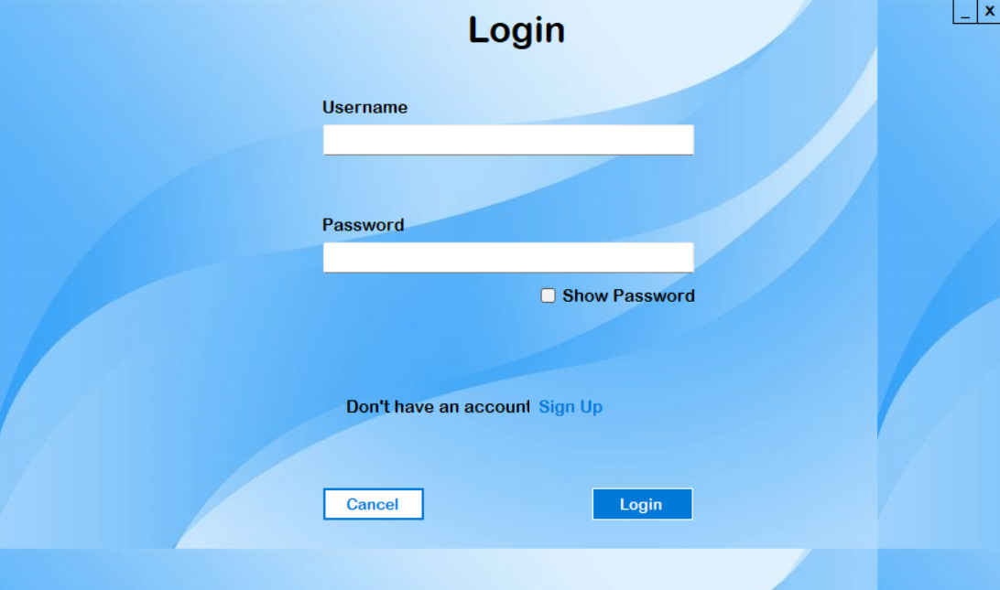

- **Register Screen**  
  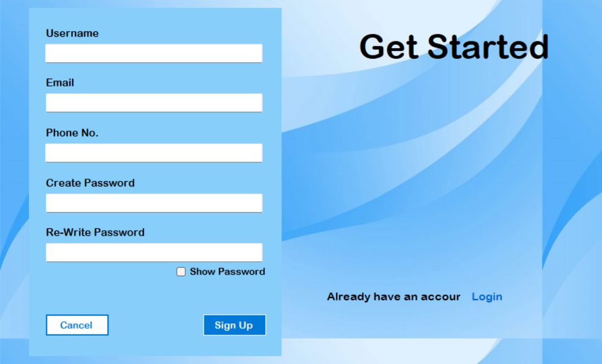

- **Dashboard**  
  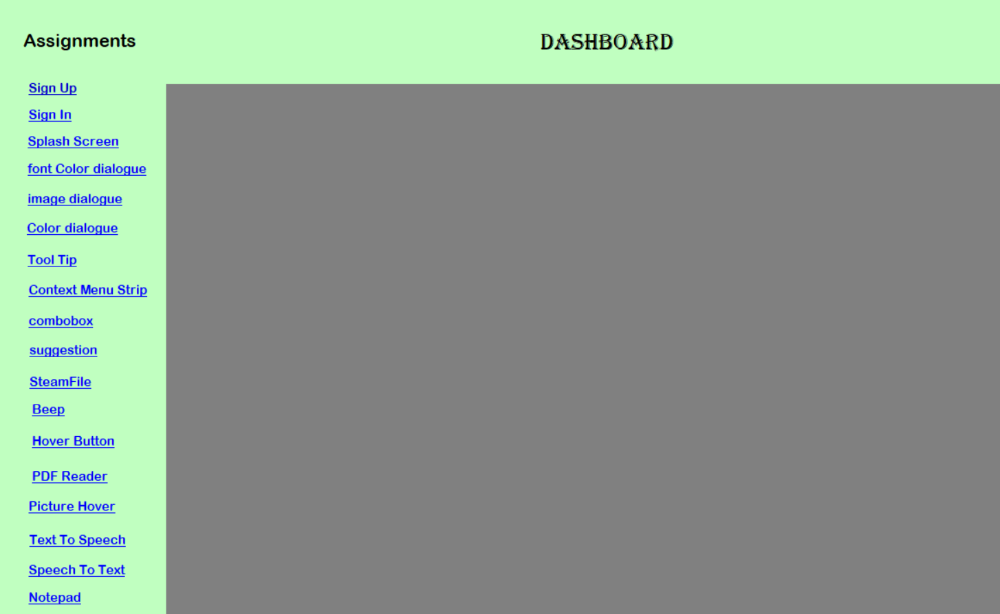

- **Mini Projects UI**:
  - **Splash Screen**: 
  - **Font Color Dialogue**: 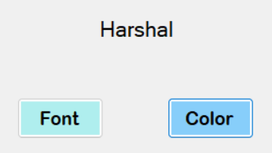
  - **Image Dialogue**: 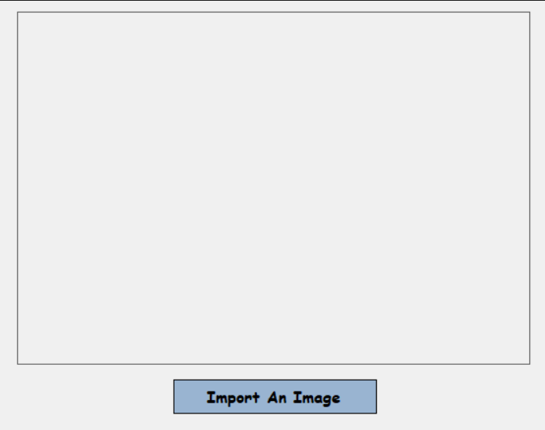
  - **Color Dialogue**: 
  - **Tool Tip**: 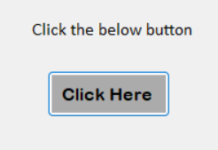
  - **Context Menu Strip**: 
  - **ComboBox**: 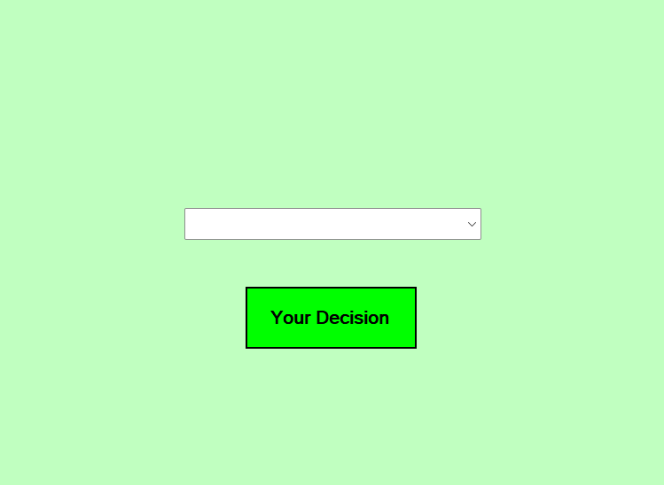
  - **Suggestion**: 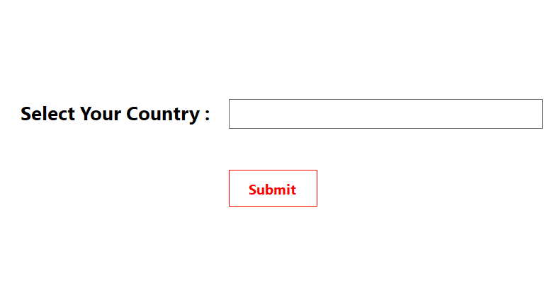
  - **Beep**: 
  - **Hover Button**: 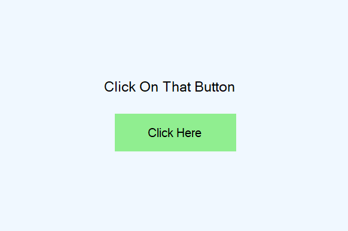
  - **PDF Reader**: 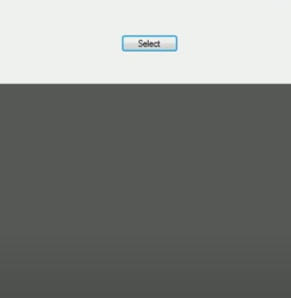
  - **Picture Hover**: 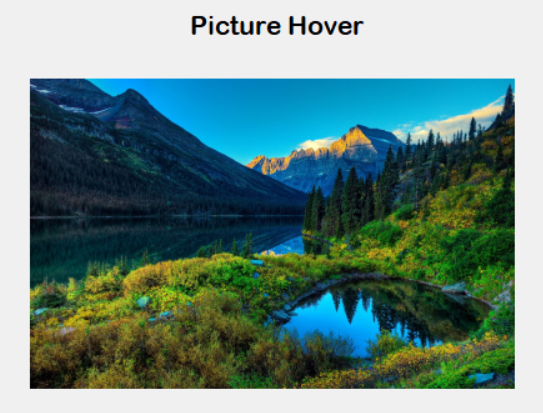
  - **Text To Speech**: 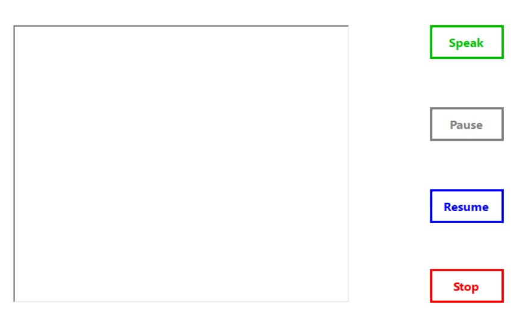
  - **Speech To Text**: 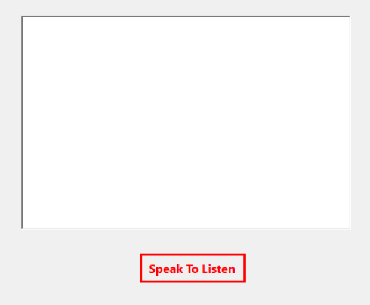
  - **Notepad**: 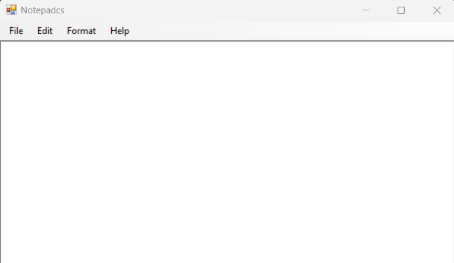

## Technologies Used

- **C#**
- **.NET Framework** (targeting versions 4.6.1 and 4.8)
- **Visual Studio**

## License

This project is licensed under the terms specified in the [LICENSE](LICENSE) file.

## Contributing

Contributions are welcome! To contribute:

1. Fork the repository.
2. Create a new branch (`git checkout -b feature/your-feature`).
3. Commit your changes (`git commit -am 'Add new feature'`).
4. Push the branch (`git push origin feature/your-feature`).
5. Open a Pull Request describing your changes.

---

Happy coding!
```

---

### Next Steps

1. **Add Your Screenshots:**  
   Create a folder (e.g., `screenshots/`) in your repository and add your UI images. Update the image paths in the README if necessary.

2. **Customize Details:**  
   Modify the descriptions, add any additional details or acknowledgments, and adjust the instructions as per your project specifics.

If you have any further questions or need additional customization, feel free to ask!
