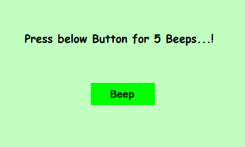

This repository contains a collection of **mini projects** developed using **C#** and the **.NET Framework**. The application starts with a **Register** and **Login** screen, and upon successful authentication, displays a **Dashboard** (AIO.cs) that serves as a central hub to access various assignments. Each assignment demonstrates a specific functionality or UI feature in C#.

--- 

## 📚 Table of Contents

- [Features](#features)
- [Installation](#installation)
- [Usage](#usage)
- [Technologies Used](#technologies-used)
- [License](#license)

---

## ✨ Features

<br>

### 🔐 User Authentication  
- **Sign Up / Register**: Allows new users to create an account.  

  

  <br>


- **Sign In / Login**: Enables registered users to log in securely.  

    

<br>

### 🏠 Dashboard  
- **Dashboard (AIO.cs)**: Displays a central hub with links to each mini project.  

    

---

### 🛠 Mini Projects  
Below is a brief description of each mini project along with a screenshot of the UI:  

<br>

- **Text To Speech**:  
  Converts written text into audible speech. 🎤 

    

<br>

- **Speech To Text**:  
  Transcribes spoken words into text. 🗣️  

    

<br>

- **Font Color Dialogue**:  
  It lets users select and change the font and the color of text elements. 🎨 

    

<br>

- **Image Dialogue**:  
  Provides a file dialog to select and display images. 🖼️  

    

<br>

- **Tool Tip**:  
  Demonstrates how to use tooltips to offer additional information on UI controls. 💡  

    

<br>

- **ComboBox**:  
  Shows different implementations of combo box controls for selection tasks. ⬇️  

    

<br>

- **Suggestion**:  
  Provides context-based suggestions to the user based on their input. 💭  

    

<br>

- **Beep**:  
  Generates a beep sound to serve as a notification or alert. 🔔  

    

<br>

- **Hover Button**:  
  Illustrates visual changes when the mouse hovers over a button. 👆  

    

<br>

- **PDF Reader**:  
  Allows users to open and view PDF documents. 📄  

    

<br>

- **Picture Hover**:  
  Demonstrates interactive effects when hovering over images. 🖌️  

    

<br>

- **Notepad**:  
  A simple text editor for basic note-taking. 📝 

    

<br>

- **QR Code Generator**:  
  Generates QR codes from input text. 🔳  

    

<br>

- **Image Processing**:  
  Apply filters and transformations to images:  
  - 🔹 **Grayscale**  
  - 🔹 **Reddish, Greenish, Bluish effects**  
  - 🔹 **Symmetry & Mirror effects**  
  - 🔹 **Binarization (Thresholding)**  

    


---

## 🛠 Installation

### Clone the Repository
```bash
git clone https://github.com/hk-kumawat/C-hash-Mini-Projects.git
```

---

## ⚙️ Usage

1. **Authentication**
   - On startup, choose to **Register** if you are a new user, or **Login** if you already have an account.

2. **Navigating the Dashboard**
   - After a successful login, the **Dashboard (AIO.cs)** will be displayed.
   - Click on the links corresponding to the mini projects to open and interact with them.

3. **Interacting with Assignments**
   - Each mini project opens in a separate window demonstrating its specific functionality (e.g., color dialogues, tool tips, PDF reader, etc.).

---

## 💻 Technologies Used

- **C#**
- **.NET Framework**
- **Visual Studio**

---

## 📜 License

This project is licensed under the terms specified in the [LICENSE](LICENSE) file.

---

```
Happy coding! 🧑🏻‍💻
```
